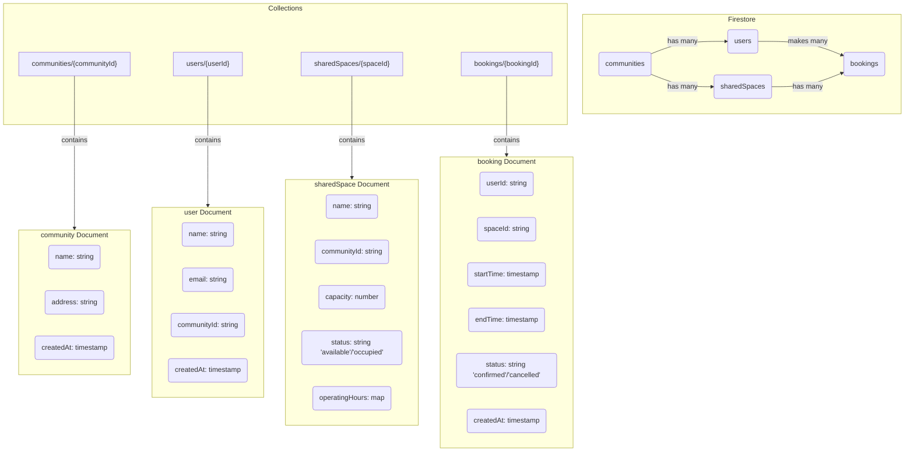

# Soviet Union App

This project is a Flutter application.

## Folder Structure

The project follows a feature-driven directory structure to promote modularity and scalability.

```
lib/
├── main.dart          # Entry point of your app
├── screens/           # Individual UI screens for each feature
├── widgets/           # Reusable UI components shared across the app
├── models/            # Data models representing the app's data structures
├── services/          # Business logic, API calls, and other services
```

### Directory Purpose

- **`lib/`**: The main container for all Dart code in the application.
- **`main.dart`**: The entry point of the application. It initializes the app and sets up the root widget.
- **`screens/`**: Contains the primary UI screens of the application. Each screen is typically a separate file and represents a major feature or view.
- **`widgets/`**: Holds reusable UI components that can be shared across multiple screens. This promotes code reuse and a consistent UI.
- **`models/`**: Defines the data structures for the application. These are plain Dart classes that represent the data fetched from an API or used within the app.
- **`services/`**: Contains the business logic of the application, such as API communication, database interactions, and other background services.

### Modular App Design

This folder structure supports a modular app design by separating concerns:

- **UI (`screens/`, `widgets/`)**: The UI is kept separate from the business logic, making it easier to modify the look and feel of the app without affecting the underlying functionality.
- **Data (`models/`)**: By defining data models in one place, we ensure a consistent data structure throughout the app.
- **Logic (`services/`)**: Centralizing business logic makes it easier to manage and test.

This separation allows different developers to work on different parts of the app simultaneously with minimal conflicts.

### Naming Conventions

To maintain a clean and readable codebase, we follow these naming conventions:

- **Files**: `snake_case.dart` (e.g., `home_screen.dart`, `custom_button.dart`).
- **Classes**: `PascalCase` (e.g., `HomeScreen`, `CustomButton`).
- **Widgets**: `PascalCase` for widget classes (e.g., `CustomButton`).
- **Variables and Functions**: `camelCase` (e.g., `userName`, `fetchUserData()`).
- **Constants**: `camelCase` or `UPPER_SNAKE_CASE` for top-level constants.

## Responsive Design (MediaQuery + LayoutBuilder)

This project includes a responsive screen implementation using `MediaQuery`
and `LayoutBuilder` to adapt UI across phone and tablet sizes. The main
example is `lib/screens/responsive_home.dart` which switches layouts based
on `constraints.maxWidth` (from `LayoutBuilder`) while using
`MediaQuery` for device metrics and orientation.

Key snippet:

```dart
// inside build()
return LayoutBuilder(
	builder: (context, constraints) {
		final isTablet = constraints.maxWidth >= 600;
		final orientation = MediaQuery.of(context).orientation;

		final int columns = isTablet
			? (orientation == Orientation.portrait ? 3 : 4)
			: 2;

		// build header and grid using computed values
	},
);
```

## Asset Management (images & icons)

This project demonstrates how to add and use local assets (images and icons).

1. Folder structure (create under project root):

```
assets/
	images/
		logo.png
		banner.jpg
	icons/
		star.png
		profile.png
```

2. Registration: `pubspec.yaml` now includes:

```yaml
flutter:
	assets:
		- assets/images/
		- assets/icons/
```

3. Demo screen: `lib/screens/asset_demo.dart` shows usage of `Image.asset` and built-in `Icon` widgets.

Example snippet:

```dart
Image.asset('assets/images/logo.png', width: 140, height: 140, fit: BoxFit.cover)
Icon(Icons.flutter_dash, color: Colors.blue)
```

4. Notes & common issues:

- Ensure correct indentation in `pubspec.yaml` (2 spaces).
- Run `flutter pub get` after adding assets.
- If images don't appear, confirm file paths and that assets are present.

## Test Cases

- **Logged-in state persists after restart:**
  1.  Open the app.
  2.  Log in.
  3.  Close the app completely.
  4.  Reopen the app.
  5.  **Expected:** The app should open directly to the `Dashboard` screen.

- **Logged-out state persists after restart:**
  1.  Open the app and log in.
  2.  Log out from the `Dashboard`.
  3.  Close the app completely.
  4.  Reopen the app.
  5.  **Expected:** The app should open to the `AuthScreen`.

- **Session changes reflect immediately:**
  1.  Log in to the app.
  2.  You should be on the `Dashboard`.
  3.  Press the logout button.
  4.  **Expected:** You should be immediately redirected to the `AuthScreen`.

- **No flickering or incorrect routing:**
  1.  Open the app when logged out.
  2.  **Expected:** The `AuthScreen` should be displayed without any brief flashes of the `Dashboard`.
  3.  Log in.
  4.  **Expected:** The `Dashboard` should be displayed without any brief flashes of the `AuthScreen`.

You can capture screenshots from emulators (phone and tablet), add them to `screenshots/`, and reference them in the PR description.

Add screenshots of the demo and your `pubspec.yaml` snippet to the `screenshots/` folder for the PR.

## 2. Firestore Schema Design

### Data Requirements List

Based on the problem statement, the core entities the app will manage are:

- **Users:** Residents of the housing community who will use the app.
- **Communities:** The housing societies or complexes.
- **SharedSpaces:** The common facilities available for booking (e.g., gym, pool, community hall).
- **Bookings:** Reservations made by users for a specific shared space and time slot.
- **Notifications:** Alerts sent to users regarding their bookings or space availability.

### Firestore Schema

Here is the proposed Firestore database structure.

#### Collections

- `communities`
- `users`
- `sharedSpaces`
- `bookings`

#### Schema Diagram (Mermaid.js)



### Detailed Structure

#### `communities`

This collection stores information about each housing community.

- **`communities/{communityId}`**
  - `name`: `string` (e.g., "Grandview Apartments")
  - `address`: `string` (e.g., "123 Lakeview Drive, Metropolis")
  - `createdAt`: `timestamp`

#### `users`

This collection holds data for each resident.

- **`users/{userId}`** (Document ID from Firebase Authentication)
  - `name`: `string` (e.g., "Jane Doe")
  - `email`: `string` (e.g., "jane.doe@email.com")
  - `communityId`: `string` (Reference to `communities/{communityId}`)
  - `createdAt`: `timestamp`

#### `sharedSpaces`

This collection contains details for all shared spaces across all communities.

- **`sharedSpaces/{spaceId}`**
  - `name`: `string` (e.g., "Gym")
  - `communityId`: `string` (Reference to `communities/{communityId}`)
  - `capacity`: `number` (e.g., 20)
  - `status`: `string` (e.g., "available", "occupied", "maintenance")
  - `operatingHours`: `map` (e.g., `{ "open": "06:00", "close": "22:00" }`)
  - `rules`: `array` of `string` (e.g., ["No food allowed", "Clean equipment after use"])

#### `bookings`

This collection tracks all reservations made by users.

- **`bookings/{bookingId}`**
  - `userId`: `string` (Reference to `users/{userId}`)
  - `spaceId`: `string` (Reference to `sharedSpaces/{spaceId}`)
  - `startTime`: `timestamp`
  - `endTime`: `timestamp`
  - `status`: `string` (e.g., "confirmed", "cancelled", "completed")
  - `createdAt`: `timestamp`

### Sample Documents

**Community Document:**

```json
{
  "name": "Grandview Apartments",
  "address": "123 Lakeview Drive, Metropolis",
  "createdAt": "2025-01-15T10:00:00Z"
}
```

**User Document:**

```json
{
  "name": "Jane Doe",
  "email": "jane.doe@email.com",
  "communityId": "community_abc_123",
  "createdAt": "2025-02-01T11:30:00Z"
}
```

**Shared Space Document:**

```json
{
  "name": "Gym",
  "communityId": "community_abc_123",
  "capacity": 20,
  "status": "available",
  "operatingHours": {
    "open": "06:00",
    "close": "22:00"
  },
  "rules": ["No food allowed", "Clean equipment after use"]
}
```

**Booking Document:**

```json
{
  "userId": "user_xyz_789",
  "spaceId": "space_gym_456",
  "startTime": "2025-03-10T18:00:00Z",
  "endTime": "2025-03-10T19:00:00Z",
  "status": "confirmed",
  "createdAt": "2025-03-09T14:00:00Z"
}
```

## Firebase Storage Reflection

### Upload Flow

The process of uploading an image from the device to Firebase Storage involves these main steps:

1.  **Image Picker**: The `image_picker` package is used to allow the user to select an image from their device's gallery.
    ```dart
    final ImagePicker picker = ImagePicker();
    final XFile? file = await picker.pickImage(source: ImageSource.gallery);
    ```
2.  **Upload Logic**: The selected image file is then uploaded to a specified path in Firebase Storage. A unique filename is generated using the current timestamp to avoid overwriting files.
    ```dart
    final fileName = DateTime.now().millisecondsSinceEpoch.toString();
    await FirebaseStorage.instance
      .ref("uploads/$fileName.jpg")
      .putFile(File(file!.path));
    ```
3.  **Getting Download URL**: After the upload is complete, a public download URL is retrieved for the image. This URL can be stored (e.g., in Firestore) and used to display the image in the app.
    ```dart
    final url = await FirebaseStorage.instance
      .ref("uploads/$fileName.jpg")
      .getDownloadURL();
    ```

### Why Firebase Storage is Useful

Firebase Storage is incredibly useful for media-heavy applications for several reasons:

- **Scalability**: It's built on Google Cloud Storage, providing massive scalability. You don't have to worry about running out of space or handling traffic spikes.
- **Security**: It has a robust security model, allowing you to control who can upload and download files based on Firebase Authentication and custom rules.
- **Cost-Effective**: It offers a generous free tier and a pay-as-you-go pricing model, making it affordable for projects of all sizes.
- **Easy Integration**: It's part of the Firebase ecosystem, so it integrates seamlessly with other Firebase services like Firestore, Authentication, and Cloud Functions.

### Potential Use Cases in This App

In the context of the "Soviet Union" app, file uploads could be used for:

- **User Profile Pictures**: Allowing users to upload their own profile pictures.
- **Shared Space Images**: Users could upload images of the shared spaces, like photos of an event in the community hall or a picture of a maintenance issue.
- **Documents**: Uploading and sharing documents related to the community.

### Issues Faced

During the implementation, a dependency conflict arose between `firebase_auth` and `firebase_storage`. The versions I was using were not compatible.

`Because firebase_auth 6.1.4 depends on firebase_core ^4.4.0 and firebase_storage 12.0.0 depends on firebase_core ^3.1.0, firebase_auth 6.1.4 is incompatible with firebase_storage 12.0.0.`

To resolve this, I had to downgrade the `firebase_auth` package to a compatible version (`^5.0.0`) in `pubspec.yaml` to make it work with `firebase_storage: ^12.0.0`. After updating the dependency and running `flutter pub get`, the issue was resolved.
